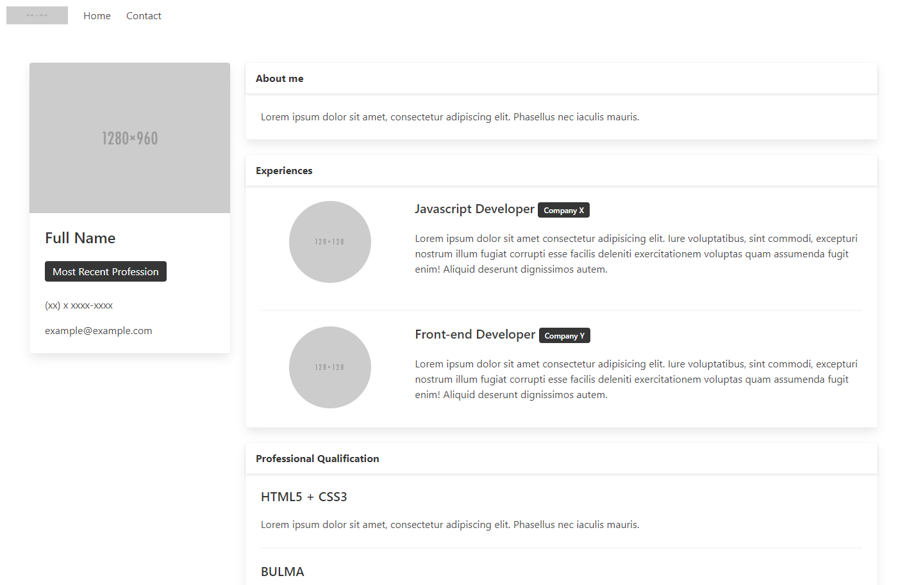

# Curriculum

>This project aims to create a model to be used as a professional portfolio, where the user will be able to inform their personal data, make an introduction about it, enter their latest experiences, their professional qualifications and also have a contact page.

## About

This project is 100% responsive and was developed with  and .
